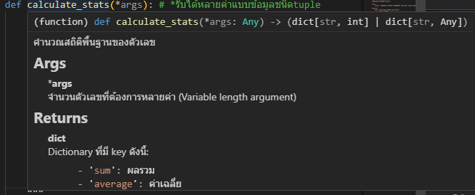

# 13. Docstrings

## Docstrings คืออะไร?
> **Docstring** (Documentation String) คือสตริงที่อธิบายว่าฟังก์ชัน/คลาส/โมดูล ทำอะไร  
> เป็นเครื่องมือสำคัญในการสร้างเอกสาร (documentation) และช่วยให้ผู้อื่นเข้าใจโค้ดของคุณ  
> ใช้ triple quotes `"""..."""` หรือ `'''...'''` และวางไว้บรรทัดแรกของฟังก์ชัน

## ความแตกต่าง: Comments vs Docstrings

| ลักษณะ | Comments | Docstrings |
|--------|----------|-----------|
| **สัญลักษณ์** | `#` (บรรทัดเดียว) | `"""..."""` หรือ `'''...'''` |
| **ที่ตั้ง** | ทุกที่ | บรรทัดแรกของฟังก์ชัน/คลาส |
| **เข้าถึงได้** | ไม่ได้ | ได้ผ่าน `function.__doc__` หรือ `help(function)` |
| **จุดประสงค์** | อธิบายว่าทำไม/อย่างไร | อธิบายว่าอะไร/ทำอะไร |
| **ใช้ที่** | บันทึกหมายเหตุสั้นๆ | เอกสารปกติ/ความช่วยเหลือ |

## โครงสร้างพื้นฐาน

### 1. Simple Docstring (One-liner)
```python
def greet(name):
    """ทักทายผู้ใช้ด้วยชื่อของพวกเขา"""
    print(f"สวัสดี {name}")

greet("Alice")
# เข้าถึง docstring
print(greet.__doc__)  # ทักทายผู้ใช้ด้วยชื่อของพวกเขา
```

### 2. Multi-line Docstring (Detailed)
```python
def add(a, b):
    """
    บวกเลขสองตัวเข้าด้วยกัน
    
    Args:
        a (int/float): ตัวเลขตัวแรก
        b (int/float): ตัวเลขตัวที่สอง
    
    Returns:
        int/float: ผลบวก
    
    Example:
        >>> add(3, 4)
        7
    """
    return a + b

print(add.__doc__) #มันจะเอาข้อความที่พิมข้างบนลงมาแสดง
```
**ตัวอย่าง**
```py
def calculate_stats(*args): # *รับได้หลายค่าแบบข้อมูลชนิดtuple
    """
    คำนวณสถิติพื้นฐานของตัวเลข
    
    Args:
        *args: จำนวนตัวเลขที่ต้องการหลายค่า (Variable length argument)
        
    Returns:
        dict: Dictionary ที่มี key ดังนี้:
            - 'sum': ผลรวม
            - 'average': ค่าเฉลี่ย
            - 'max': ค่าสูงสุด
            - 'min': ค่าต่ำสุด
        หากไม่มีค่าใดได้ฯ จะคืน Dictionary ที่ทุกค่าเป็น 0
    """
    if not args:
        return {"sum": 0, "average": 0, "max": 0, "min": 0} # กรณีไม่มีค่าเข้ามา

    total = sum(args)
    average = total / len(args)
    maximum = max(args)
    minimum = min(args)
    return {"sum": total, "average": average, "max": maximum, "min": minimum}
   
print(calculate_stats(10, 20, 30, 40, 50))
print(calculate_stats(5, 5))
print(calculate_stats())
```
มันจะแสดงเมื่อเอาเม้าส์ไปจ่อที่ฟังก์ชั่น

### กฎพื้นฐาน:
1. ใช้ triple quotes `"""` (ทั้งแม้ว่า one-liner)
2. บรรทัดแรกต้องเป็นบรรทัดสรุป (summary) ที่สั้นและชัดเจน
3. หากมีบรรทัดเพิ่มเติม ให้มีบรรทัดว่างระหว่าง summary และรายละเอียด
4. สิ้นสุดด้วย triple quotes บนบรรทัดเดียวกัน (สำหรับ one-liner)
