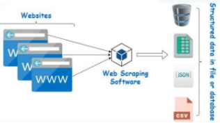
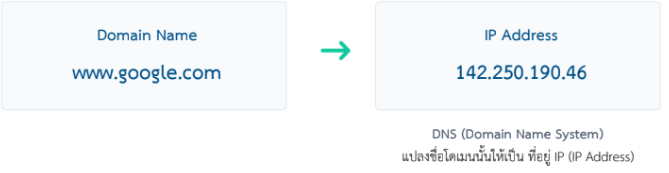
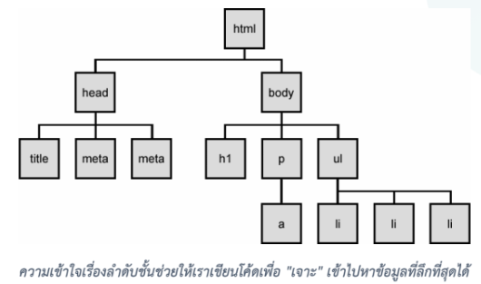
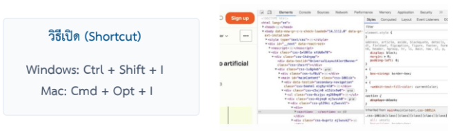
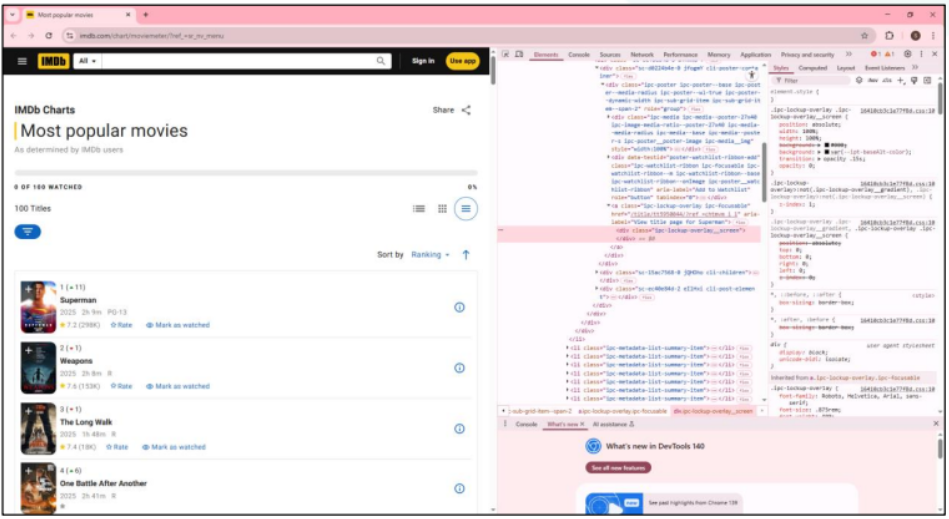

# Web Scraping with Python
## Introduction
Web scraping คือกระบวนการดึงข้อมูลจากเว็บไซต์โดยอัตโนมัติ เป็นเทคนิคที่มีประโยชน์ในการรวบรวมข้อมูลจำนวนมากจากอินเทอร์เน็ต

ผลลัพธ์คือการเปลี่ยน ข้อมูลดิบ (Raw HTML)
ให้เป็นข้อมูลที่นำไปใช้งานต่อได้ เช่น CSV,
Excel หรือ Database



---

# Part 1: Web Scraping Fundamentals 

## กระบวนการทำงาน 

Web scraping ทำงานผ่าน 5 ขั้นตอนหลัก:

1. Request (ส่งคำขอ)
ส่งคำขอไปที่ URL ที่ต้องการดึงข้อมูล ผ่าน HTTP request

2. Response (รับโค้ด HTML)
รับโค้ด HTML กลับมาจากเซิร์ฟเวอร์

3. Parse (วิเคราะห์โครงสร้าง)
วิเคราะห์โครงสร้าง HTML ให้อยู่ในรูปแบบที่สามารถค้นหาและจัดการได้

4. Extract (ดึงเฉพาะข้อมูลที่ต้องการ)
ดึงเฉพาะข้อมูลที่ต้องการจาก HTML โดยใช้ selectors ต่างๆ

5. Store (บันทึกข้อมูล)
บันทึกข้อมูลเพื่อใช้งาน เช่น ไฟล์ CSV, JSON, หรือ Database

---

## ไฟล์ robots.txt 
เป็นไฟล์ข้อความธรรมดาที่อยู่ใน Root Directory ของเว็บไซต์ (เช่น domain.com/robots.txt)

<span style="color:lightblue;">**หน้าที่หลัก**</span> กำหนดกฎ ให้บอท (Bots/Crawlers)ว่าอนุญาตให้เข้าถึงข้อมูลส่วนใดได้บ้าง เป็นมาตรฐานจริยธรรมในการทำ web scraping ที่ควรตรวจสอบก่อนเริ่มต้น

<span style="color:lightgreen;">**ตัวอย่าง**</span>
```plain
User-agent: * # กฎนี้ใช้กับบอททุกตัวในโลก
Disallow: /admin/ # ห้ามบอทเข้าไปในโฟลเดอร์ admin
Disallow: /private/ # ห้ามบอทเข้าไปในโฟลเดอร์ private
Allow: /blog/ # อนุญาตให้เข้าถึงได้ทุกส่วน
```

>"การไม่ปฏิบัติตาม robots.txt อาจถือว่าละเมิดจริยธรรมและนำไปสู่การถูกแบน IP ได้"

<span style="color:lightgreen;">**ตัวอย่าง**</span>
```plain
User-agent: *
Disallow: /cart/

Disallow: /checkout/

User-agent: Googlebot
Allow: /
```
ในตัวอย่างนี้ บอททั่วไปห้ามเข้าหน้าตะกร้าสินค้า แต่ Google เข้าถึงได้ทุกหน้าเพื่อนำไปทำ Search Index

---

## How Web Browsers Work 
Browser ทฎหน้าที่เป็น Client (ผู้ร้องขอ) เพื่อเข้าถึงข้อมูลจาก Server (ผู้ให้บริการ) บนเครือข่ายอินเทอร์เน็ต กระบวนการทำงานสามารถสรุปได้เป็นขั้นตอนหลัก ๆ ดังต่อไปนี้

### 1. การแปลงโดเมนเนม (DNS Resolution)
เมื่อผู้ใช้พิมพ์ URL เช่น www.example.com ในเบราว์เซอร์ ขั้นตอนแรกคือการแปลงโดเมนเนมเป็นที่อยู่ IP ที่เซิร์ฟเวอร์ใช้ในการสื่อสาร กระบวนการนี้เรียกว่า DNS Resolution โดยเบราว์เซอร์จะติดต่อกับ DNS Server เพื่อค้นหาที่อยู่ IP ที่เกี่ยวข้องกับโดเมนเนมที่ผู้ใช้ป้อน



### 2&3. การส่งคำขอและการตอบสนองจากเซิร์ฟเวอร์  (HTTP REQUEST & RESPONSE)
- Request : Client ส่ง "ความต้องการ" เช่น อยากได้หน้า index.html ของเว็บนี้
- Process : Server รับคำขอและประมวลผล จากนั้นส่งกลับข้อมูลที่ร้องขอ (เช่น HTML, CSS, JS) พร้อมกับสถานะการตอบสนอง (เช่น 200 OK)
- Response : Server ส่ง "ผลลัพธ์" กลับมา พร้อม Status Code และเนื้อหาที่ร้องขอ

#### ทำวามรู้จัก HTTP STATUS CODES
>HTTP Status Codes คือ รหัสมาตรฐานที่เซิร์ฟเวอร์ส่งกลับมาให้เบราว์เซอร์ เพื่อบอกให้รู้ว่า คำขอ (Request) นั้น "สำเร็จ" หรือ "เกิดปัญหาอะไรขึ้น"

| Code | Status | คำอธิบาย |
|------|--------|----------|
| 200 | OK | คำขอสำเร็จและเซิร์ฟเวอร์ส่งข้อมูลที่ร้องขอกลับมาได้ตามปกติ |
| 301 | Moved Permanently | URL เปลี่ยนแล้ว ต้องดึงจากที่ใหม่ |
| 403 | Forbidden | เซิร์ฟเวอร์ปฏิเสธการเข้าถึงทรัพยากรนี้ แม้จะได้รับคำขอที่ถูกต้องแล้ว |
| 404 | Not Found | ไม่พบหน้าเว็บหรือทรัพยากรที่ร้องขอบนเซิร์ฟเวอร์ |
| 500 | Internal Server Error | เซิร์ฟเวอร์เกิดข้อผิดพลาดภายใน ทำให้ไม่สามารถตอบสนองคำขอได้ |

### 4. Processing & Rendering (HTML/CSS/JS)
เมื่อเบราว์เซอร์ได้รับข้อมูลจากเซิร์ฟเวอร์แล้ว ขั้นตอนต่อไปคือการประมวลผลและแสดงผลข้อมูลนั้นบนหน้าจอ โดยเบราว์เซอร์จะทำการ:
- ประมวลผล HTML เพื่อสร้างโครงสร้างของหน้าเว็บ
- ประมวลผล CSS เพื่อกำหนดรูปแบบและการจัดวางขององค์ประกอบต่าง ๆ บนหน้าเว็บ
- ประมวลผล JavaScript เพื่อเพิ่มความสามารถในการโต้ตอบและฟังก์ชันต่าง ๆ ให้กับหน้าเว็บ

---

# DOM Tree (Document Object Model) 
DOM Tree คือโครงสร้างข้อมูลที่เบราว์เซอร์สร้างขึ้นจาก HTML ที่ได้รับมา โดยจะแปลง HTML เป็นโครงสร้างแบบต้นไม้ (Tree Structure) ซึ่งแต่ละองค์ประกอบใน HTML จะถูกแทนด้วย Node ใน DOM Tree
- Node คือหน่วยพื้นฐานใน DOM Tree ที่แทนองค์ประกอบต่าง ๆ เช่น
  - Element Node (แทนแท็ก HTML เช่น `<div>, <p>`)
  - Text Node (แทนข้อความภายในแท็ก)
  - Attribute Node (แทนแอตทริบิวต์ของแท็ก เช่น class, id)

## ลำดับชั้น (Hierarchy) ใน DOM
DOM Tree มีลำดับชั้นที่แสดงความสัมพันธ์ระหว่างองค์ประกอบต่าง ๆ ใน HTML โดยมีลำดับชั้นดังนี้:



## ทำไม DOM สำคัญกับการ Scraping
DOM เป็นโครงสร้างที่ช่วยให้เราสามารถเข้าถึงและดึงข้อมูลจากหน้าเว็บได้อย่างมีประสิทธิภาพ โดยการใช้เครื่องมือเช่น BeautifulSoup หรือ Selenium เราสามารถเลือก Node ที่ต้องการจาก DOM Tree เพื่อดึงข้อมูลที่ต้องการได้อย่างง่ายดาย และ บางครั้งข้อมูลไม่มี Class หรือ ID ให้ระบุตรง ๆ เราจึงต้องใช้วิธี:
- หา Parent ที่ระบุได้แน่นอนก่อน 
- สั่งให้โปรแกรม "เดินลงไป" (Navigate) หา Child ที่ต้องการ
>การเดินตามเส้นทางของ Tree เรียกว่าการทำ "Traversing"

---

# Part 2: Tools & Setup

## The Inspect Tool (การสำรวจโครงสร้างเว็บไซต์)
## ทำไมต้องใช้ INSPECT?
ก่อนเขียนโค้ด เราต้องรู้ว่าข้อมูลที่เราต้องการซ่อนอยู่ใน Tag ไหน และมี Class/ID อะไรบ้าง เพื่อให้เราสามารถเขียนโค้ดดึงข้อมูลได้ถูกต้อง

<span style="color:red;">**ขั้นตอนการใช้งานเครื่องมือ Inspect**</span>
- คลิกขวาบนองค์ประกอบ (element) ที่ต้องการสำรวจ แล้วเลือก Inspect หรือตรวจสอบ



- หน้าต่าง Developer Tools จะเปิดขึ้น และแสดงโครงสร้าง HTML ของหน้าเว็บ
- ใช้เครื่องมือเลือก (Select Element) เพื่อคลิกที่องค์ประกอบที่ต้องการตรวจสอบในหน้าเว็บ
- ดูรายละเอียดขององค์ประกอบที่เลือก เช่น Tag, Class, ID และ Attribute ต่าง ๆ

## การใช้งานหน้าต่าง ELEMENTS
1. คลิกไอคอน ลูกศร (Select) ที่มุมซ้ายบน

2. นำเมาส์ไปชี้ที่ข้อความหรือรูปภาพในหน้าเว็บ

3. ดูโค้ดที่ถูกไฮไลต์ในแถบ Elements

4. จดจำ Tag และ Class ที่เกี่ยวข้อง



---

## Python: Requests Module
โมดูล requests ใช้สำหรับส่งคำขอ HTTP ไปยัง URL ที่กำหนดและส่งคืนผลลัพธ์ที่ได้กลับมา

<span style="color:red;">**ติดตั้ง Requests ด้วยคำสั่ง**</span>
```python
pip install requests
```

<h5 style="font-size:20px;"> ตัวอย่างการใช้งาน Requests</h5>

```python
import requests # นำเข้าโมดูล requests
url = "http://quotes.toscrape.com/" # กำหนดที่อยู่เว็บไซต์ (URL)

response = requests.get(url) # ส่งคำขอไปยัง URL และรับข้อมูลกลับมา

print("Status Code:", response.status_code) # แสดง HTTP Status Code

# แสดงเนื้อหา HTML ทั้งหมดของหน้าเว็บนั้นออกมาเป็นข้อความ (String)
print(response.text)
```

<span style="color:red;">**ผลลัพธ์ที่ได้**</span>
```html
Status Code: 200 # หมายความว่าคำขอสำเร็จและเซิร์ฟเวอร์ส่งข้อมูลกลับมาได้ตามปกติ
<!DOCTYPE html>
<html lang="en">
<head>
	<meta charset="UTF-8">
	<title>Quotes to Scrape</title>
    <link rel="stylesheet" href="/static/bootstrap.min.css">
    <link rel="stylesheet" href="/static/main.css">
    
    
</head>
<body>
    <div class="container">
        <div class="row header-box">
            <div class="col-md-8">
                <h1>
                    <a href="/" style="text-decoration: none">Quotes to Scrape</a>
                </h1>
            </div>
            <div class="col-md-4">
                <p>
                
                    <a href="/login">Login</a>
                
                </p>
...
        </div>
    </footer>
</body>
</html>
```

---

## Static vs. Dynamic Websites

### Static Website (เหมาะกับ BeautifulSoup) เนื้อหาของหน้าเว็บไม่เปลี่ยนแปลงตามการโต้ตอบของผู้ใช้ ข้อมูลทั้งหมดถูกส่งมาในครั้งเดียวเมื่อโหลดหน้าเว็บ
    
> **ลักษณะ:** เมื่อส่ง Request ไปยัง Server จะได้รับไฟล์ HTML ที่มีข้อมูลครบถ้วนทันที

### Dynamic Website (เหมาะกับ Selenium) เนื้อหาของหน้าเว็บเปลี่ยนแปลงตามการโต้ตอบของผู้ใช้ เช่น การคลิกปุ่ม การเลื่อนหน้า หรือการกรอกข้อมูล ข้อมูลบางส่วนอาจถูกโหลดผ่าน JavaScript หลังจากที่หน้าเว็บถูกโหลดแล้ว
    
> **ลักษณะ:** เมื่อส่ง Request ไปยัง Server จะได้รับไฟล์ HTML ที่มีข้อมูลบางส่วนเท่านั้น ข้อมูลที่เหลือจะถูกโหลดผ่าน JavaScript

---

# Part 3: BeautifulSoup Library

## BeautifulSoup Introduction 

<span style="color:red;">**ติดตั้ง BeautifulSoup ด้วยคำสั่ง**</span>
```python
pip install beautifulsoup4
```

### สร้างวัตถุ BeautifulSoup
```python 
from bs4 import BeautifulSoup # นำเข้าไลบรารี BeautifulSoup
soup = BeautifulSoup(response.text,'html.parser')
# ตอนนี้สามารถค้นหาข้อมูลผ่านตัวแปน soup ได้แล้ว
# ได้ผลลัพธ์เป็นวัตถุ BeautifulSoup ที่มีโครงสร้างของ HTML 
# ที่ได้รับมาจาก response.text ที่เรียกดูด้วยโค้ดข้างบน
```

---

## Parser Selection 

BeautifulSoup รองรับหลาย Parser ที่แตกต่างกันในเรื่องความเร็ว ความสามารถ และการติดตั้ง ตารางด้านล่างแสดงความแตกต่างของ Parser ต่างๆ:

| Parser | ความเร็ว | ความสามารถ | การติดตั้ง |
|--------|---------|----------|----------|
| html.parser | ปานกลาง | ปานกลาง | มาพร้อม Python |
| lxml | เร็วมาก | ดีมาก | ต้องติดตั้งเพิ่ม |
| html5lib | ช้า | สูงสุด (เหมือน Browser) | ต้องติดตั้งเพิ่ม |

### การติดตั้ง Parser เพิ่มเติม

```bash
# ติดตั้ง lxml
pip install lxml

# ติดตั้ง html5lib
pip install html5lib
```

### การใช้งาน Parser ต่างๆ

```python
from bs4 import BeautifulSoup

# ใช้ html.parser (default, ไม่ต้องติดตั้ง)
soup = BeautifulSoup(html_content, 'html.parser')

# ใช้ lxml (เร็วที่สุด, ต้องติดตั้ง)
soup = BeautifulSoup(html_content, 'lxml')

# ใช้ html5lib (แม่นยำที่สุด, เหมือน Browser)
soup = BeautifulSoup(html_content, 'html5lib')
```

### ข้อแนะนำการเลือก Parser

- **html.parser**: ใช้สำหรับงานที่ไม่ต้องการความเร็วสูง และต้องการใช้ได้ทั่วไป
- **lxml**: ใช้เมื่อต้องการความเร็วสูง (ดีที่สุด)
- **html5lib**: ใช้เมื่อต้องการ Parse ที่แม่นยำที่สุด และเหมือนการทำงานของ Browser

---

## 4 Main Objects in BeautifulSoup

BeautifulSoup มี 4 วัตถุหลัก ที่เป็นพื้นฐานของการทำงาน:

### 1. Tag (แท็ก)
Tag แสดงถึง HTML tag เช่น `<div>`, `<p>`, `<a>` เป็นต้น สามารถเข้าถึงข้อมูลและ attribute ได้

```python
from bs4 import BeautifulSoup

html = """
<div class="container" id="main">
    <p>Hello World</p>
</div>
"""

soup = BeautifulSoup(html, 'html.parser')
# เลือกแท็ก <div> จากวัตถุ soup และเก็บไว้ในตัวแปร div
# syntax: soup.find('tag_name') จะค้นหาแท็กแรกที่ตรงกับชื่อที่ระบุ
# ถ้าไม่ใช้ find() syntax: soup.tag_name ก็จะได้แท็กแรกที่ตรงกับชื่อแท็กนั้นเช่นกัน
div = soup.find('div') 

# Tag name 
print(div.name)  # div 

# Attributes
print(div['class'])  # ['container']
print(div.get('id'))  # main

# Tag ที่ซ้อนกัน
p = div.find('p')
print(p.name)  # p
```

### 2. NavigableString (ข้อความที่สามารถเลื่อนได้)
NavigableString คือ ข้อความภายใน Tag สามารถเดินเข้า-ออกระหว่าง elements ได้

```python
from bs4 import BeautifulSoup

html = """<p>Hello <b>Beautiful</b> World</p>"""
soup = BeautifulSoup(html, 'html.parser')

p = soup.find('p')

# เข้าถึงข้อความ
for string in p.strings:
    print(string)
# Output:
# Hello 
# Beautiful
#  World

# ใช้ get_text() เพื่อดึงข้อความทั้งหมด
print(p.get_text())  # Hello Beautiful World

# ตรวจสอบประเภท
from bs4 import NavigableString

print(isinstance(p.b.string, NavigableString))  # True
```

### 3. BeautifulSoup (วัตถุหลัก)
BeautifulSoup Object คือ วัตถุหลักที่แทนเอกสาร HTML ทั้งหมด ใช้สำหรับค้นหา element ต่างๆ

```python
from bs4 import BeautifulSoup

html = """
<html>
    <head><title>My Page</title></head>
    <body>
        <h1>Welcome</h1>
    </body>
</html>
"""

soup = BeautifulSoup(html, 'html.parser')

# BeautifulSoup มี properties เช่น
print(soup.name)  # [document]

# ค้นหา elements
title = soup.find('title')
print(title.string)  # My Page
```

### 4. Comment (ความเห็น/ข้อมูลคอมเมนต์)
Comment เป็น NavigableString พิเศษที่อยู่ในรูป HTML comment `<!-- -->`

```python
from bs4 import BeautifulSoup, Comment

html = """
<div>
    <p>Visible text</p>
    <!-- This is a comment -->
    <p>More text</p>
</div>
"""

soup = BeautifulSoup(html, 'html.parser')

# หา comment 
comment = soup.div.contents[1]
print(comment) # <!-- This is a comment -->
print(type(comment))
```

### สรุป 4 วัตถุหลักใน Beautiful Soup

| Object Type | หน้าที่ | ตัวอย่าง |
|-------------|--------|---------|
| **Tag** | จัดการ Element และ Attribute | `soup.div` / `soup.find('p')` |
| **NavigableString** | ดึงข้อความภายใน tag | `tag.string` / `tag.get_text()` |
| **BeautifulSoup** | เข้าถึงเอกสาร HTML ทั้งหมด | `soup` / `soup.find()` |
| **Comment** | ดึงค่า Comment HTML | `<!-- text -->` / `soup.find(string=lambda text: isinstance(text, Comment))` |

---

# Part 4: BeautifulSoup Methods 

## Finding Elements 
ค้นหาและส่งคืน element ตัวแรกที่ตรงกับเงื่อนไข

> ⚠️ หากไม่พบข้อมูล find() จะคืนค่าเป็น None เสมอ ควรตรวจสอบค่าก่อนใช้งานต่อ

```python
from bs4 import BeautifulSoup

html = """
<html>
    <body>
        <h1>Welcome</h1>
        <p class="intro">First paragraph</p>
        <p class="intro">Second paragraph</p>
        <a href="https://example.com">Link</a>
    </body>
</html>
"""

soup = BeautifulSoup(html, 'html.parser')

# หา tag ด้วยชื่อ
first_p = soup.find('p')
print(first_p)  # <p class="intro">First paragraph</p>

# หา tag ด้วย attribute
intro = soup.find('p', class_='intro')
print(intro.text)  # First paragraph

# หา tag ด้วย id 
link = soup.find('a', id='my_link') # None เพราะไม่มี id="my_link"
```

### 2. find_all() - หา Elements ทั้งหมด
ค้นหาและส่งคืน list ของ elements ทั้งหมดที่ตรงกับเงื่อนไข

```python
# หาทุก paragraph
# ถ้าต้องการหา Tag หลาย ๆ ชนิดพร้อมกัน ให้ส่งค่าเป็น List
all_p = soup.find_all('p')
for p in all_p:
    print(p.text)
# Output:
# First paragraph
# Second paragraph

# หา elements ที่เจาะจง
# หาทุก <p> ที่มี class="intro"
intro_paragraphs = soup.find_all('p', class_='intro')
print(len(intro_paragraphs))  # 2

# หาจำนวนจำกัด
first_two = soup.find_all('p', limit=2)
```

### 3. select() - ใช้ CSS Selectors
ค้นหาโดยใช้ CSS selector (เหมือน jQuery)

| Syntax | คำอธิบาย | ตัวอย่าง |
|--------|----------|---------|
| `.class` | Class Selector - ค้นหาด้วยชื่อ Class | `soup.select(".item")` |
| `#id` | ID Selector - ค้นหาด้วย ID | `soup.select("#p1")` |
| `tag1 tag2` | Nested Selector - ค้นหา Tag ที่อยู่ข้างในอันอื่น | `soup.select(".item h3")` |

```python
# หา class
texts = soup.select('.intro')

# หา id
header = soup.select('#header')

# หา tag ที่อยู่ใน tag / Nested selector
paragraphs = soup.select('div.container p')

# Attribute selector
external_links = soup.select('a[href^="http"]')

# Pseudo-selector
first_p = soup.select('p:first-of-type')
```

### 4. select_one() - CSS Selector (First Only)

```python
# หา element แรกที่ตรง selector
first_intro = soup.select_one('.intro')
print(first_intro.text)  # First paragraph
```

## Accessing Data {#accessing-data}

### เข้าถึง Attributes
ใช้ brackets [] เพื่อเข้าถึงค่าของ attribute

```python
link = soup.find('a')
print(link['href'])  # https://example.com

# หรือใช้ get() ซึ่งสามารถให้ default value ได้
href = link.get('href')
title = link.get('title', 'No title')
```

### เข้าถึง Text Content
ใช้ .text หรือ .get_text() เพื่อดึงข้อความ

```python
p = soup.find('p')
print(p.text)  # First paragraph
print(p.get_text())  # First paragraph

# ดึงข้อความจากทุก element ที่เลือก
for p in soup.find_all('p'):
    print(p.get_text(strip=True))  # strip=True ลบ whitespace
```

## NAVIGATING THE TREE (DOM Traversing) 

DOM tree ประกอบด้วยความสัมพันธ์ระหว่าง elements: parent, children, siblings เป็นต้น BeautifulSoup ให้เครื่องมือในการเดินผ่านแต่ละความสัมพันธ์นี้

```
    <div>                          ← Parent
        <h1>Title</h1>             ← Child (Sibling)
        <p>First</p>               ← Child (Sibling)
        <p>Second</p>              ← Child (Sibling)
    </div>
```

### 1. Navigating Downward (Parent → Children)

ใช้เพื่อเข้าถึงลูกของ element

```python
html = """
<div id="main">
    <h1>Welcome</h1>
    <p>First paragraph</p>
    <p>Second paragraph</p>
</div>
"""

soup = BeautifulSoup(html, 'html.parser')

# .string - เข้าถึง content ตัวแรกของ tag
h1 = soup.find('h1')
print(h1.string)  # Welcome

# .contents - ดึง children ทั้งหมด เป็น list
div = soup.find('div')
print(div.contents)  # ['\n', <h1>Welcome</h1>, '\n', <p>First paragraph</p>, '\n', ...] บรรทัดจะถูกนับเป็น child ด้วย

# .children - generator (ประหยัดหน่วยความจำมากกว่า)
for child in div.children:
    print(child) # จะได้ผลลัพธ์เหมือนกับ .contents แต่เป็น generator ที่ไม่เก็บทั้งหมดในหน่วยความจำ แต่ไม่เก็บบรรทัด \n ด้วย เก็บเฉพาะ Tag เท่านั้น เช่น <h1>Welcome</h1>

# .descendants - ดึงทุก descendants (ลูก, หลาน, เหลน...)
for descendant in div.descendants:
    if descendant.name:  # ข้ามข้อความว่าง
        print(descendant) # จะได้ค่าออกมาเป็นชนิด Tag เท่านั้น เช่น
        # <h1>Welcome</h1> 
        # <p>First paragraph</p>
        # <p>Second paragraph</p>
```

### 2. Navigating Upward (Children → Parent)

ใช้เพื่อเข้าถึงพ่อแม่ของ element

```python
# .parent - เข้าถึงพ่อแม่โดยตรง เข้าถึง Tag พ่อแม่ที่อยู่เหนือขึ้นไป 1 ชั้น
p = soup.find('p')
print(p.parent.name)  # div

# .parents - generator เข้าถึงพ่อแม่ทั้งหมดไปจนถึง root ของเอกสาร
for parent in p.parents:
    if parent:
        print(parent.name)
# Output:
# div
# body
# html
# [document]
```

### 3. Navigating Sideways (Siblings)

ใช้เพื่อเข้าถึง element ที่อยู่ระดับเดียวกัน
- ใช้สำหรับหา Tag ที่อยู่ในระดับ (Level) เดียวกัน
- .next_sibling ลำดับถัดไปในระดับเดียวกัน
- .previous_sibling ลำดับก่อนหน้าในระดับเดียวกัน
- ช่องว่าง (Newline/Whitespace) ก็นับเป็น Sibling ชนิดหนึ่ง
>ทริค: ใน HTML ที่มีการเว้นวรรค .next_sibling ตัวแรกมักจะเป็น \n (Newline)เราจึงต้องเรียกซ้ำ หรือใช้find_next_sibling() แทน

```python
html = """
<div>
    <h1>Title</h1>
    <p>First</p>
    <p>Second</p>
    <p>Third</p>
</div>
"""

soup = BeautifulSoup(html, 'html.parser')

# .next_sibling - sibling ถัดไป (รวม whitespace)
h1 = soup.find('h1')
print(h1.next_sibling)  # '\n'
print(h1.next_sibling.next_sibling)  # <p>First</p>

# .previous_sibling - sibling ก่อนหน้า
p_first = soup.find('p')
print(p_first.previous_sibling)  # '\n'
print(p_first.previous_sibling.previous_sibling)  # <h1>Title</h1>

# .next_siblings - generator สำหรับทุก next siblings
h1 = soup.find('h1')
for sibling in h1.next_siblings:
    if sibling.name:  # ข้ามข้อความว่าง
        print(sibling)
# Output:
# <p>First</p>
# <p>Second</p>
# <p>Third</p>
```

---

## Export Data with Pandas

หลังจากดึงข้อมูลมา สามารถใช้ Pandas บันทึกเป็นไฟล์ต่าง ๆ ได้

### การติดตั้ง

```bash
pip install pandas
pip install openpyxl  # สำหรับ Excel
```

### บันทึกเป็น CSV

```python
import pandas as pd

data = {
    'Name': ['Product 1', 'Product 2', 'Product 3'],
    'Price': [99, 199, 299],
    'Rating': [4.5, 4.8, 4.2]
}
df = pd.DataFrame(data)

# บันทึก
df.to_csv('products.csv', index=False, encoding='utf-8')

# อ่าน
df_read = pd.read_csv('products.csv')
```

### บันทึกเป็น Excel

```python
# บันทึก
df.to_excel('products.xlsx', index=False, sheet_name='Products')

# อ่าน
df_read = pd.read_excel('products.xlsx', sheet_name='Products')
```

### บันทึกเป็น JSON

```python
# บันทึก
df.to_json('products.json', orient='records', force_ascii=False, indent=2)

# อ่าน
df_read = pd.read_json('products.json')
```

### สร้าง DataFrame จากข้อมูลที่ Scrape

```python
import pandas as pd
from bs4 import BeautifulSoup
import requests

response = requests.get('https://example.com')
soup = BeautifulSoup(response.text, 'html.parser')

# เก็บข้อมูล
products = []

for item in soup.find_all('div', class_='product'):
    name = item.find('h3').text.strip()
    price = item.find('span', class_='price').text.strip()
    rating = item.find('span', class_='rating').text.strip()
    
    products.append({
        'Name': name,
        'Price': price,
        'Rating': rating
    })

# สร้าง DataFrame
df = pd.DataFrame(products)

# ดู
print(df.head())
print(f"Total: {len(df)}")

# บันทึก
df.to_csv('products.csv', index=False, encoding='utf-8')
```

